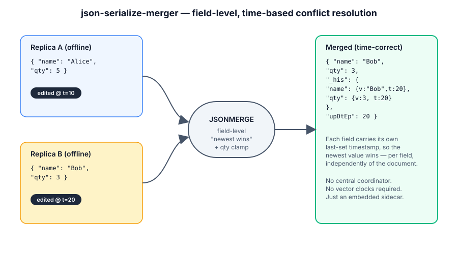
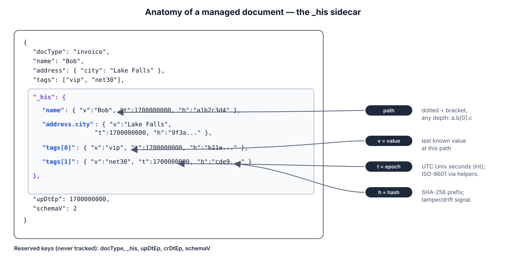
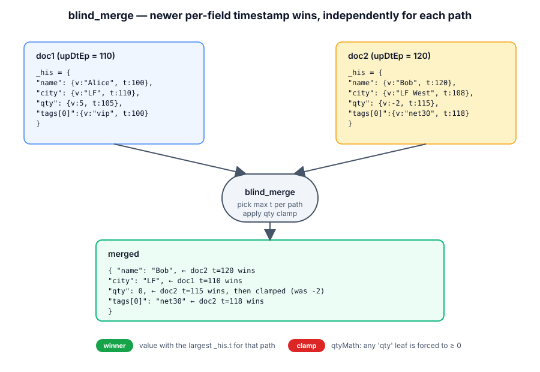
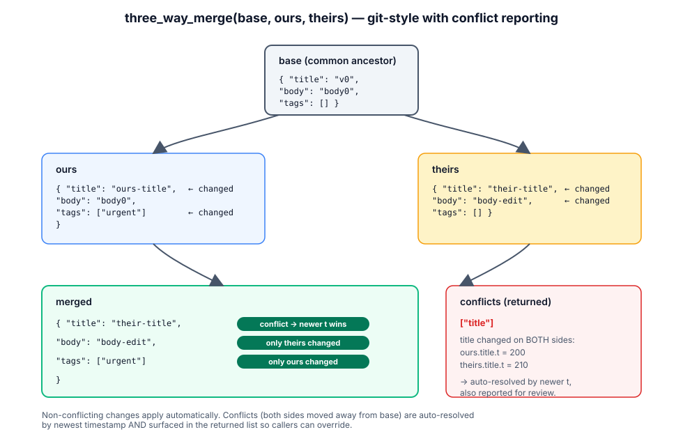

# DESIGN.md

<p align="center">
  
</p>

## High-Level Design and Architecture (v2)

`json-serialize-merger` is a small, self-contained library that performs
**field-level, timestamp-based conflict resolution** for JSON documents.
It is aimed at JSON document stores (Couchbase / Couchbase Mobile, but
any KV/Document DB will do) where two or more replicas of the same
document can be edited concurrently and must be reconciled into a
single "time correct" document.

The library is **library-only** (no transport, no persistence). It
takes plain JSON-shaped dicts in and returns plain JSON-shaped dicts.

> **v2 change**: tracking is no longer limited to root-level scalars.
> Arbitrary nesting (objects, arrays, deeply nested combinations) is
> supported via dotted/bracket path keys in the `_his` sidecar.

---

## 1. Goals & Non-Goals

### Goals
- Embed lightweight, per-field bookkeeping (`_his`) inside a JSON document.
- Support **arbitrary nesting**: objects, arrays, and any depth combination.
- Provide deterministic merge semantics based on per-field epoch timestamps.
- Provide **content hashes** (`h`) per field for tamper / drift detection.
- Provide a **diff** that round-trips through RFC 6902 JSON Patch.
- Offer a **three-way merge** (base / ours / theirs) for git-style flows.
- Stay dependency-free (Python standard library only).
- Stay portable / easy to translate to other languages (Node, Go, C#, …).

### Non-Goals
- No CRDT semantics (no causal ordering beyond wall-clock time).
- No network, storage, schema, or auth concerns.
- No automatic clock-drift correction (caller owns clock trust).
- No automatic structural merge of large nested arrays as a single value
  (each leaf is tracked individually instead).

---

## 2. Core Concept: The `_his` Sidecar (v2)

<p align="center">
  
</p>

Each managed document carries a top-level bookkeeping object named
`_his`. It maps a **path string** (dotted + bracket notation) to a
record:

```json
{
  "docType": "invoice",
  "name": "Bob",
  "address": { "city": "Lake Falls", "zip": "8000" },
  "tags": ["vip", "net30"],
  "lines": [
    { "sku": "A-1", "qty": 5 },
    { "sku": "B-2", "qty": 3 }
  ],
  "_his": {
    "name":          { "v": "Bob",  "t": 1700000000, "h": "a1b2c3d4" },
    "address.city":  { "v": "Lake Falls", "t": 1700000000, "h": "..." },
    "address.zip":   { "v": "8000", "t": 1700000000, "h": "..." },
    "tags[0]":       { "v": "vip",  "t": 1700000000, "h": "..." },
    "tags[1]":       { "v": "net30","t": 1700000000, "h": "..." },
    "lines[0].sku":  { "v": "A-1",  "t": 1700000000, "h": "..." },
    "lines[0].qty":  { "v": 5,      "t": 1700000000, "h": "..." },
    "lines[1].sku":  { "v": "B-2",  "t": 1700000000, "h": "..." },
    "lines[1].qty":  { "v": 3,      "t": 1700000000, "h": "..." }
  },
  "upDtEp":  1700000000,
  "crDtEp":  1700000000,
  "schemaV": 2
}
```

### Record fields

| key  | meaning                                                                |
|------|------------------------------------------------------------------------|
| `v`  | last known value of the leaf                                           |
| `t`  | **integer Unix epoch seconds (UTC)** when `v` was set                  |
| `h`  | short SHA-256 (first 8 hex) of `v` — used to detect tampering / drift  |

### Timestamps: epoch in storage, ISO on demand

All stored timestamps are **integer Unix epoch seconds**. This is the
smallest, most portable, time-zone-free representation and is what every
storage engine and language can sort/compare cheaply. Helper functions
convert to/from ISO-8601 when humans need to read them:

```python
JsonMerge.now_epoch()                # 1700000000
JsonMerge.epoch_to_iso(1700000000)   # '2023-11-14T22:13:20Z'
JsonMerge.iso_to_epoch('2023-11-14T22:13:20Z')  # 1700000000
m.history_iso(doc)                   # _his with extra 'tIso' field
```

### Path notation

Paths use **dotted segments** plus **bracket indices**:
- `name`                — top-level scalar
- `address.city`        — nested object
- `tags[0]`             — array element
- `lines[2].sku`        — array of objects
- `a.b[0].c[1].d`       — arbitrary depth

The library also exposes RFC 6901 **JSON Pointer** translation for the
`diff_docs` / `patch_doc` API surface (`/a/b/0/c/1/d`).

### Reserved keys (never tracked)

`_his`, `upDtEp`, `crDtEp`, `schemaV`, `docType`. Anything in
`JSONMERGE.noCheck` is also skipped.

---

## 3. Module Layout

```diagram
example_python/
├── JsonMerge.py
├── test_new_doc.py
├── test_update_doc.py
├── test_request_merge.py
├── test_blind_merge.py
├── test_nested_and_helpers.py
└── test-sample-json-data/
```

The library is a single self-contained file so that sibling ports
(`example_node_js/`, `example_c_sharp/`, …) can mirror it 1:1.

```diagram
╭──────────────────────────────────────────────────────╮
│ JsonMerge.py                                         │
│  • module-level helpers                              │
│      now_epoch, now_iso, epoch_to_iso, iso_to_epoch  │
│      parse_path, get/set/del_at_path, has_path       │
│      flatten, unflatten                              │
│      value_hash, hash_doc                            │
│  • class JSONMERGE                                   │
│      make_new_doc  / makeNewDoc                      │
│      update_doc    / updateDoc                       │
│      diff_docs                                       │
│      patch_doc           (RFC 6902 subset)           │
│      merge_doc_request / mergeDocReq                 │
│      blind_merge       / blindMerge                  │
│      three_way_merge                                 │
│      history_iso, list_changes_since                 │
│      is_managed, validate                            │
╰──────────────────────────────────────────────────────╯
```

snake_case is canonical; camelCase aliases are kept for backwards
compatibility with the v1 tests and any existing call sites.

---

## 4. Public API

| Group          | Function                              | Purpose                                                                |
|----------------|---------------------------------------|------------------------------------------------------------------------|
| Time           | `now_epoch()`                         | Current UTC epoch seconds                                              |
| Time           | `now_iso()`                           | Current UTC ISO-8601                                                   |
| Time           | `epoch_to_iso(ep)`                    | Format an epoch as ISO-8601 (`...Z`)                                   |
| Time           | `iso_to_epoch(iso)`                   | Parse ISO-8601 → epoch seconds                                         |
| Path           | `parse_path(p)`                       | `'a.b[0].c'` → `['a','b',0,'c']`                                       |
| Path           | `get_at_path / set_at_path / del_at_path` | Read/write any nested location                                     |
| Path           | `has_path`                            | Existence check                                                        |
| Path           | `flatten(doc)`                        | Tree → `{path: leaf}` dict                                             |
| Path           | `unflatten(flat)`                     | `{path: leaf}` → tree                                                  |
| Hash           | `value_hash(v)`                       | Stable short SHA-256 of any JSON value                                 |
| Hash           | `hash_doc(doc)`                       | Hash of user-data (excludes `_his`)                                   |
| Lifecycle      | `make_new_doc(doc)`                   | Stamp a plain doc with full `_his`                                    |
| Lifecycle      | `update_doc(doc, changes)`            | Apply legacy/dotted/nested change shapes                               |
| Diff           | `diff_docs(a, b)`                     | RFC 6902 JSON Patch (`add`/`replace`/`remove`) from `a` → `b`          |
| Diff           | `patch_doc(doc, ops)`                 | Apply a JSON Patch and refresh `_his`                                 |
| Merge          | `merge_doc_request(d1, d2)`           | Apply newer fields from `d2` (possibly different `docType`) into `d1`  |
| Merge          | `blind_merge(d1, d2)`                 | Symmetric reconcile of two replicas                                    |
| Merge          | `three_way_merge(base, ours, theirs)` | Git-style 3-way merge; returns `(merged, conflicting_paths)`           |
| Inspect        | `history_iso(doc)`                    | `_his` with ISO timestamps added                                      |
| Inspect        | `list_changes_since(doc, ep)`         | Fields modified at or after `ep`                                       |
| Inspect        | `is_managed(doc)`                     | Has `_his` + `upDtEp`?                                                |
| Inspect        | `validate(doc)`                       | Warnings (tamper, drift, untracked fields, dead `_his` paths)         |

### Configuration flags

| flag         | default | effect                                                  |
|--------------|---------|---------------------------------------------------------|
| `addCrEp`    | `True`  | write `crDtEp` on create                                |
| `addCrIso`   | `False` | write `crDt` (ISO) on create                            |
| `addUpIso`   | `False` | write `upDt` (ISO) on every update                      |
| `addHashes`  | `True`  | store per-field `h` content hash                        |
| `qtyMath`    | `True`  | clamp any `…qty` leaf to `>= 0` after every merge       |
| `debug`      | `False` | verbose printing                                        |

### Accepted `update_doc` shapes

```python
m.update_doc(doc, [{"name": "Bob"}])                # legacy
m.update_doc(doc, [{"address.city": "Lake Falls"}]) # dotted path
m.update_doc(doc, [{"tags[1]": "net60"}])           # array index
m.update_doc(doc, {"address": {"zip": "8001"}})     # nested dict (deep)
```

---

## 5. Data Flow

### 5.1 Create
```diagram
╭──────────╮  make_new_doc   ╭─────────────────────────────────╮
│ raw JSON │────────────────▶│ JSON + _his + upDtEp + crDtEp  │
╰──────────╯                 │ (flattened paths, hashes)       │
                             ╰─────────────────────────────────╯
```

### 5.2 Update
```diagram
╭───────────────╮ changes  ╭───────────────╮
│ managed JSON  │─────────▶│ managed JSON' │
│ (_his)       │  v1+v2   │ (_his bumped │
╰───────────────╯  shapes  │  per path)    │
                           ╰───────────────╯
```
For each `(path, new_val)`: skip if reserved or value unchanged; else
`set_at_path(doc, path, new_val)` and refresh `_his[path] = {v, t, h}`.

### 5.3 Diff / Patch (interop)
```diagram
╭──────╮  diff_docs  ╭───────────────╮  patch_doc   ╭──────╮
│ doc A│────────────▶│ JSON Patch ops│─────────────▶│ doc' │
╰──────╯             ╰───────────────╯              ╰──────╯
```
Lets external tools (`jsondiffpatch`, `deepdiff`, `jsonpatch.js`) round-trip
through the library: produce patches elsewhere, apply here and keep
`_his` consistent.

### 5.4 Request Merge (asymmetric)
```diagram
╭────────────╮    ╭──────────────────╮
│ doc1       │    │ doc2             │
│ "invoice"  │    │ "invoiceRequest" │
╰─────┬──────╯    ╰────────┬─────────╯
      ╰──────────┬─────────╯
                 ▼
          merge_doc_request()
                 │
   for path in doc1._his ∩ doc2._his:
       if doc2[path].t > doc1[path].t and v differs:
           change = (path, _resolve_qty(...))
                 │
                 ▼
           update_doc(doc1, changes)
           _clamp_qty_fields(doc1)
```

### 5.5 Blind Merge (symmetric)

<p align="center">
  
</p>

```diagram
              ╭────────────╮   ╭────────────╮
              │ doc1       │   │ doc2       │
              ╰─────┬──────╯   ╰─────┬──────╯
                    ╰────────┬───────╯
                             ▼
                       blind_merge()
                             │
   base = doc w/ newer upDtEp; overlay newer per-field from other
                             │
                             ▼
                       merged doc
```

### 5.6 Three-way Merge (git-style)

<p align="center">
  
</p>

```diagram
       ╭──────╮
       │ base │
       ╰──┬───╯
   ╭──────┴──────╮
   ▼             ▼
╭──────╮     ╭────────╮
│ ours │     │ theirs │
╰──┬───╯     ╰────┬───╯
   ╰──────┬───────╯
          ▼
   three_way_merge()
          │
   for each path in (ours ∪ theirs ∪ base):
     • only one side changed   → take that side
     • both sides changed same → no-op
     • both sides changed diff → CONFLICT
           → default-resolve by newer timestamp + qtyMath
           → path is reported in conflicts[]
          ▼
   (merged, [conflicting paths])
```

---

## 6. Merge Rules (Summary)

1. **Field granularity, full depth.** Each tracked leaf (scalar, empty
   dict, empty list) carries its own `(v, t, h)` tuple in `_his`.
2. **Newer `t` wins** in pairwise comparisons.
3. **Reserved keys are never tracked or merged.**
4. **`qty` is special.** When `qtyMath` is enabled, any leaf whose final
   path segment is `qty` is clamped to `>= 0` after every merge. This is
   inventory-safe behaviour (the README's "BONUS").
5. **Per-field hash (`h`)** is recomputed on every write; `validate()`
   flags any drift, catching out-of-band edits that bypass the merger.
6. **Three-way merges report conflicts** instead of silently choosing —
   callers can intercept conflicts before accepting the auto-resolution.

---

## 7. Limits & Known Caveats

- **Per-leaf granularity, not "smart" array merge.** Concurrent inserts at
  the same array index will both be tracked under the same path string
  (`tags[0]`); the merger picks one. For ordered-collaboration semantics
  (Yjs/Automerge style) a CRDT is the right tool.
- **Wall-clock dependence.** Clock skew, NTP drift, or user-tampered
  device clocks can yield "wrong" winners.
- **No schema validation.** The library trusts JSON-shaped dicts with
  consistent types per path.
- **Hashing is not cryptographic strength** (8-hex-char SHA-256 prefix).
  It's a cheap tamper / drift signal, not an integrity proof — use a full
  digest if needed.

---

## 8. Recommendations / Future Direction

These are the improvements the design is shaped to accommodate; the
hooks already exist in v2 so each is additive.

### 8.1 Vector clocks (causality, not just wall-clock)
Extend each `_his` record with a `clk: {nodeId: counter}` map. The
single decision point is `JSONMERGE._pick_newer(a, b)` — swap its body
to: "if `a.clk` dominates `b.clk` → a wins, if `b` dominates → b wins,
else fall back to `t`". This adds true causal ordering with one local
change.

### 8.2 Highest-revision-wins overlay
Add a doc-level `_rev` integer that bumps on every `update_doc`. The
host application can prefer the higher revision and use `_his` only as
an audit trail.

### 8.3 First-class JSON Patch / `jsondiffpatch` import
`diff_docs` already emits RFC 6902 ops and `patch_doc` already consumes
them. The remaining additions: `move`, `copy`, `test` ops. With those,
arbitrary external diff tools become drop-in change sources.

### 8.4 Field-level merge policies
A `policies: {path_glob: policy_name}` config: e.g.
`{"lines[*].qty": "sum", "tags": "set_union"}`. The merger dispatches to
the named resolver instead of "newest wins". `_resolve_qty` is the
prototype.

### 8.5 Store `_his` in Couchbase **xattrs**
Move the sidecar out of the document body into Couchbase extended
attributes so application code never sees `_his`. Add an
`extract_meta` / `inject_meta` pair (already trivial because of
`RESERVED_KEYS`).

### 8.6 Cryptographic tamper proof
Replace `h` (8-char) with a full SHA-256 or HMAC keyed with a per-tenant
secret. `value_hash` is the single function to swap.

### 8.7 Append-only event log
Instead of overwriting `_his[path]` on update, append to
`_his[path].log = [{t, v, h}, ...]`. This gives a full per-field
history (replay, time-travel queries) at the cost of size.

### 8.8 Schema / type guards
Optional `schema: {path: type}` config. `update_doc` rejects type
changes. Catches "value became a string instead of an int" bugs early.

### 8.9 Cross-language ports
Because the file is self-contained, mirroring `example_node_js/`,
`example_c_sharp/`, `example_go/`, etc. is straightforward. Keep the
on-disk format identical so docs can travel between language stacks.

---

## 9. Architectural Summary

```diagram
╭────────────────────────────────────────────────────────────╮
│                    Host Application                        │
│  (reads/writes JSON to Couchbase / Mobile / any KV store)  │
╰───────────────────────────┬────────────────────────────────╯
                            │ dict in / dict out
                            ▼
                ╭───────────────────────╮
                │       JSONMERGE       │
                │ make_new_doc          │
                │ update_doc            │
                │ diff_docs / patch_doc │
                │ merge_doc_request     │
                │ blind_merge           │
                │ three_way_merge       │
                │ validate / history_iso│
                ╰───────────┬───────────╯
                            │ reads/writes _his sidecar
                            ▼
                ╭────────────────────────────╮
                │  _his: {path: (v, t, h)}  │
                │  paths: name, a.b, tags[0] │
                │  t: epoch seconds (UTC)    │
                │  h: short content hash     │
                ╰────────────────────────────╯
```

The library is a **pure function layer** over JSON dicts: stateless,
side-effect free (aside from optional debug prints), and trivially
embeddable in any process that talks to a JSON document store.
